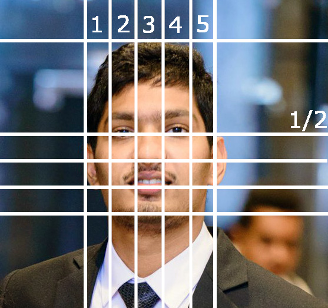

# Multi Gaze Interactions - Docs

Multi Gaze Interactions application provides multi-user gaze tracking, which can be used with any standard camera in real-time. The application includes a pre-trained model using [Columbia Gaze Dataset](http://www.cs.columbia.edu/CAVE/databases/columbia_gaze)
for gaze prediction and Haar cascade filters for face and facial features detection.

The Artistic Heuristics can assist in getting rid of false-positives or at
least reducing the number of false-positives.  Facial detection using Artistic Heuristics is a method of using relative location to determine facial features. By drawing vertical lines over a face by equally splitting a human face into five sections, the site of eyes in a human face should be between the 1/5th, 4/5th lines, and they must be next to the mid-line as illustrated in the below image.   
  

The Multi Gaze Interactions was written solely in Python3. Therefore, if the users have Python installed already on the machine, it is a matter of a couple of command lines the Multi Gaze Interactions application is ready to be used. To run the application, the users need to connect their webcams and enter a command for the Python code to run. 

Source : [https://github.com/nirdslab/multigazeinterations](https://github.com/nirdslab/multigazeinterations)

## Online Demo
  
  
## Desktop Demo Application
  * The application that tracks the multi-users gaze compatible with any standard webcams  
  * Less initial calibration  
  * Reduce the number of false positive detections with the application of Haar cascade filters and artistic heuristics  
  * Easy to install with just a few command lines  

## Running from Source

#### Requirements: 
  * Python 3.7 or higher
  * Pip 19.3 or higher
  
#### Clone the source

```shell 
git clone https://github.com/nirdslab/multigazeinterations.git
```

#### Install Dependencies
```shell 
pip3 install -r requirements.txt 
```

#### Runnning Application

```shell
# Realtime Gaze tracking with webcam (or equivalent)
python realtime.py 
```

```shell 
# Testing gaze tracking on images
python image_test.py <image path>
# Example
python image_test.py test.jpg
```

## API Usage


## About Us
